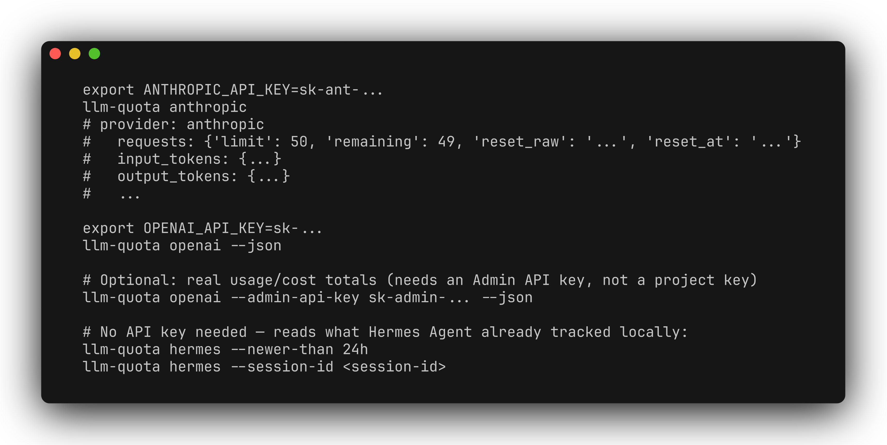

# llm-quota-mcp

[](README.md) [](README.zh-CN.md)

Inspect LLM API rate-limit headers and locally recorded Hermes Agent usage through a CLI, Python API, or stdio MCP server. This is **not a monthly-credit balance or subscription-quota tracker**: unavailable fields remain `None`/`null` with explanatory notes.



## What it reads

- **Anthropic:** a `count_tokens` probe and any rate-limit headers returned. The probe does not generate a paid completion; headers may be absent.
- **OpenAI:** a minimal chat completion to inspect request/token windows. This is a real API call with a small token cost. An optional organization Admin API key enables historical usage/cost queries; a normal project key does not.
- **Hermes:** local token and cost records obtained through `hermes sessions export`. This reports usage already incurred, not remaining provider quota.

## Install

Requires Python 3.10+. Provider probes use `requests`; the MCP extra installs the MCP SDK. The Hermes reader additionally needs a compatible `hermes` executable on PATH.

```bash
git clone https://github.com/zhuhroscar-tech/llm-quota-mcp.git
cd llm-quota-mcp
python3 -m venv .venv
source .venv/bin/activate
pip install -e ".[mcp]"
llm-quota --help
```

For CLI-only use, install with `pip install -e .` instead.

## CLI and Python

Provide `ANTHROPIC_API_KEY` or `OPENAI_API_KEY` through your local secret-management environment. Optional OpenAI settings are `OPENAI_ADMIN_API_KEY` and `OPENAI_ORG_ID`.

```bash
llm-quota anthropic --json
llm-quota openai --json
llm-quota hermes --newer-than 24h --json
```

Use `--model` to select a model your provider key can access. Network/authentication errors or unsupported probe models can prevent a report.

```python
import os
from llm_quota import get_anthropic_quota

quota = get_anthropic_quota(api_key=os.environ["ANTHROPIC_API_KEY"])
print(quota.requests.remaining, quota.requests.reset_at)
```

## MCP setup

Register `llm-quota-mcp` as a **stdio** server in your host. A host using the `mcpServers` convention can use:

```json
{
  "mcpServers": {
    "llm-quota": {"command": "/absolute/path/to/.venv/bin/llm-quota-mcp"}
  }
}
```

Replace the executable path. Supply secrets to the server process using your host's environment/secret mechanism; configuration schemas differ by host. Tools are `check_anthropic_quota`, `check_openai_quota`, and `check_hermes_usage`.

## Safety and tests

Never commit keys or paste them into agent conversations. Prefer environment credentials over per-call key arguments, and grant Admin API access only when needed. Results can contain sensitive usage/cost information. Rate-window snapshots are not guarantees that a later request will succeed.

```bash
pip install -e ".[dev]"
pytest -v
```

Provider tests mock HTTP; live account behavior is not established by those tests. Hermes integration coverage depends on an available compatible CLI. [MIT license](LICENSE).
